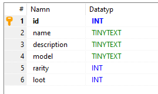
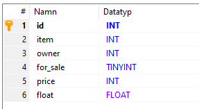
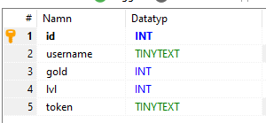
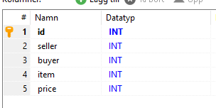

# Server for our Unity mobile game

This is the server for our unity mobile game. It keeps track of all users who are
identified with an authentication token given on the first startup of the game.
The item contains infromation about all kinds of items [Indexed Items](#items-index) that store name, rarity and 3D asset of the item. When an item is created it is inserted into the [Items](#dropped-items) table. This is an actual item, one of a kind that has an owner, unique identifier and a market status.

The server also saves all market transactions so a market history can be displayed for the players and also analyzed by us.

# Setup the server

The server is needed to properly work on and test the game.
It will host a Websocket server on a given port (default 1113)

(If you want to change to port you have to edit Game/OnlineConnection.cs and Server/Index.js)

### Prerequisites:

-   MySQL Server
-   NodeJS & NPM

### Steps

1. Download this repo `git clone https://github.com/J-MOV/Server`
2. Install node modules `npm i`
3. Create a new sql database named `game`
4. Import the sql dump `mysql -u username -p game < database.sql`
5. Start the server `node index.js`

# Explanation of the database structure

## Items index

The items index is the list of all items in the game.

-   Name is the display name of the item in game.
-   Model is the name of the prefab used in Unity. Rarity
-   Rarity is the rarity level 0-4 ([See rarities](#rarities))
-   Loot is the loot table attribute, when an item is dropped and the rarity is determend all items of the same rarity enter a draft and the loot number is how many chances that item has to win. So the smallar loot number, the rarer the item.

## Dropped items

Dropped items are all stored in one table, this includes all items listed on the market.

-   Item is the ID of this item, references back to the items index.
-   Owner is the ID of the current item owner
-   For_Sale shows if the item is currently listed on the market.
-   Price is the listed price on the market, this is only used if the item is actually listed.
-   Float is the random float number assigned when dropped. This makes every item unique and can change the look of the item slightly.

## Rarities

Rarity determens how likley an item is to drop aswell as the color of the item type.
The rarities goes from (0-4) Common (Gray), Rare (Blue), Epic (Pink), Legendary (Yellow), Mythical (Red)

**Note** the loot attribute also changes how rare the items are to drop, but they are not visible to the player.

## Users

-   Username is choosen when the users first starts the game.
-   Gold is the amount of gold the user has.
-   Lvl is the highest cleared raid level of the user
-   Token is the login token that the users recieves when they first start the game and is always used when doing actions online to authenticate the user.

## Market transactions

Every item exchange is recorded in this table.
With this data an item can be tracked through every transfer it has made.

